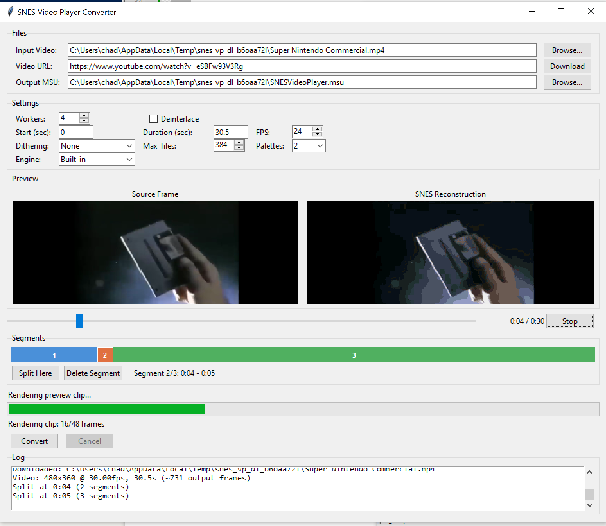

# SNES Video Player

Play any video on real Super Nintendo hardware using MSU-1.

Takes a standard video file (MP4, MKV, AVI, etc.) and produces a complete ROM package that plays the video with synchronized audio on an SD2SNES / FXPAK Pro flashcart, or in MSU-1 capable emulators like Mesen or bsnes.



## How It Works

The system has two parts:

1. **A pre-built SNES ROM** (`SNESVideoPlayer.sfc`) — a 65816 engine with SPC700 audio that boots to a title screen, then streams MSU-1 video frames to the screen with synchronized audio.

2. **A Python converter tool** — takes your video file and produces the `.msu` (video data) and `.pcm` (audio data) files the ROM needs.

The ROM is already compiled and ships in `prebuilt/`. You never need an assembler unless you want to modify the engine itself.

### What the ROM does

```
Power on → Initialize SPC700 audio engine → Upload samples
    → Display "PRESS START" with controls → Play technique sound
    → Wait for START button
    → Fade to black → Start MSU-1 video (chapter 0)
    → Stream tiles/palettes/tilemaps from .msu file at 24fps
    → Play synchronized PCM audio
    → START: pause/resume video and audio
    → Video ends → Fade to black → Auto-loop video
```

The ROM runs in Mode 1 (4BPP) at 256x160, letterboxed with 32px black borders on the 224-line SNES display. Each frame uses up to 384 tiles and 2 sub-palettes (32 colors) with Floyd-Steinberg dithering.

### What the converter does

```
Input video
    │
    ├─→ ffmpeg extracts 256x160 PNG frames at 24fps (stretch/fit/crop)
    │
    ├─→ ffmpeg extracts audio → 44100Hz stereo 16-bit PCM
    │
    ├─→ Each frame is converted to SNES tile data:
    │     1. Parse 8x8 tiles from the 256x160 image
    │     2. K-means clusters tiles into 2 sub-palette groups
    │     3. Build 15-color sub-palettes (color 0 = transparent)
    │     4. Floyd-Steinberg dither to nearest palette colors
    │     5. Encode to 4BPP bitplane format + tilemap
    │     6. Merge similar tiles down to 384 max (greedy L2)
    │
    ├─→ Package all frames into single .msu binary file
    │
    └─→ Output: SNESVideoPlayer.sfc + .msu + .pcm
```

Tile conversion runs in parallel across CPU cores. A 1-minute video at 24fps = 1,440 frames, typically taking 2-5 minutes to convert on a modern machine.

## Quick Start

### Requirements

- Python 3.8+
- ffmpeg in PATH
- [uv](https://docs.astral.sh/uv/) (recommended — auto-installed by the launcher if missing)

### GUI Mode

Double-click `converter/SNESVideoPlayer.bat` — it will install uv (if needed), create a virtual environment, install dependencies, and launch the GUI automatically.

Or run manually:

```bash
cd converter
uv run videoplayer_converter.py
```

Without uv, you can install dependencies manually and run directly:

```bash
cd converter
pip install numpy Pillow yt-dlp
python videoplayer_converter.py
```

Browse for a local video or paste a YouTube URL and click Download. Use the scrubber to preview any frame, adjust quality settings (dithering, max tiles, palettes, scale mode), then click Convert.

#### Scale Mode

Videos come in all aspect ratios — widescreen, portrait (YouTube Shorts), 4:3, etc. The **Scale Mode** setting controls how the video is fitted to the 256x160 SNES display:

- **Stretch** (default): Fills 256x160 exactly. May distort if the source aspect ratio doesn't match.
- **Fit**: Scales the video to fit inside 256x160 while preserving aspect ratio. Black bars are added to fill the remaining space (pillarbox for tall videos, letterbox for ultra-wide).
- **Crop**: Scales to cover 256x160 while preserving aspect ratio, cropping the overflow (center crop).

The **Aspect Ratio** field lets you override the source's detected aspect ratio (e.g. `16:9`, `4:3`). Leave it empty to auto-detect. Entering a value auto-switches to Fit mode if Stretch is selected.

#### Per-Segment Quality

Different scenes respond differently to SNES conversion settings — a high-contrast cartoon scene may look best with no dithering, while a soft gradient needs Floyd-Steinberg. The Segments panel lets you split your video into time-based segments, each with its own dithering method, engine, max tiles, and palette count.

1. Load a video — a single segment is created covering the full duration
2. Scrub to a scene boundary and click **Split Here** to create a new segment
3. Click a segment in the colored strip (or scrub into it) to select it
4. Adjust the quality controls — changes apply only to the selected segment
5. Click **Delete Segment** to merge a segment back into its neighbor

### CLI Mode

```bash
cd converter

# Basic conversion
python videoplayer_converter.py --cli -i video.mp4 -o SNESVideoPlayer.msu

# With options
python videoplayer_converter.py --cli -i video.mp4 -o SNESVideoPlayer.msu \
    --workers 8 --deinterlace --start 10 --duration 30

# Download from URL and convert
python videoplayer_converter.py --cli --url https://youtube.com/watch?v=ID -o SNESVideoPlayer.msu

# Experiment with quality settings
python videoplayer_converter.py --cli -i video.mp4 -o SNESVideoPlayer.msu \
    --dither ordered --max-tiles 200 --num-palettes 1

# Per-segment quality via JSON file
python videoplayer_converter.py --cli -i video.mp4 -o SNESVideoPlayer.msu \
    --segments-file segments.json

# Preserve aspect ratio (fit with black bars)
python videoplayer_converter.py --cli -i portrait_video.mp4 -o SNESVideoPlayer.msu \
    --scale-mode fit

# Crop to fill (no black bars, center crop)
python videoplayer_converter.py --cli -i widescreen.mp4 -o SNESVideoPlayer.msu \
    --scale-mode crop

# Override aspect ratio
python videoplayer_converter.py --cli -i video.mp4 -o SNESVideoPlayer.msu \
    --scale-mode fit --aspect-ratio 4:3

# Grayscale with shared palette (reduces dither swimming)
python videoplayer_converter.py --cli -i video.mp4 -o SNESVideoPlayer.msu \
    --grayscale --shared-palette
```

#### Segments File Format

The `--segments-file` flag accepts a JSON file defining per-segment quality settings. Each segment specifies a time range and its own conversion parameters:

```json
[
  {"start_time": 0.0, "end_time": 15.0, "dither_method": "floyd-steinberg",
   "engine": "builtin", "num_palettes": 2, "max_tiles": 384},
  {"start_time": 15.0, "end_time": 45.0, "dither_method": "none",
   "engine": "builtin", "num_palettes": 1, "max_tiles": 256}
]
```

Segments must be contiguous (each segment's `start_time` equals the previous segment's `end_time`). When `--segments-file` is provided, the global `--dither`, `--max-tiles`, `--num-palettes`, and `--engine` flags are ignored.

### Output Files

The converter produces a `.msu` file and a `.pcm` file. Copy the pre-built ROM alongside them:

```
your_output_folder/
├── SNESVideoPlayer.sfc    ← copy from prebuilt/
├── SNESVideoPlayer.msu    ← converter output (video data)
└── SNESVideoPlayer-0.pcm  ← converter output (audio data)
```

All three files must share the same base name and live in the same directory. The ROM's internal title (`SNES VIDEO PLAYER    `) must match the `.msu` file header — the converter handles this automatically.

Load `SNESVideoPlayer.sfc` in your emulator or copy all files to your SD2SNES / FXPAK Pro SD card.

### FXPAK Push Tool

If you have an FXPAK Pro connected via USB with QUsb2Snes running, you can push and boot the ROM directly:

```bash
python tools/fxpak_push.py                        # push prebuilt ROM, boot it
python tools/fxpak_push.py --file path/to/rom.sfc  # push a specific ROM
python tools/fxpak_push.py --no-boot                # upload only
```

### Controller Input

| Button | Action |
|--------|--------|
| START | Begin video playback (title screen) |
| START | Pause / resume (during video) |

## CLI Options

| Flag | Default | Description |
|------|---------|-------------|
| `--cli` | — | Run in CLI mode (no GUI) |
| `-i`, `--input` | — | Input video file |
| `--url` | — | Download video from URL (requires `yt-dlp`) |
| `-o`, `--output` | — | Output .msu file path |
| `-w`, `--workers` | 4 | Parallel tile conversion workers |
| `--ffmpeg` | auto | Path to ffmpeg if not in PATH |
| `--fps` | 24 | Playback frame rate |
| `--deinterlace` | off | Apply yadif deinterlace filter |
| `--start` | — | Start time in seconds |
| `--duration` | — | Duration in seconds |
| `--title` | `SNES VIDEO PLAYER` | MSU-1 title (max 21 chars) |
| `--dither` | `floyd-steinberg` | Dithering method: `none`, `floyd-steinberg`, `ordered` |
| `--max-tiles` | 384 | Max unique tiles per frame (1-384) |
| `--num-palettes` | 2 | Sub-palettes per frame: `1` or `2` |
| `--engine` | `builtin` | Tile conversion engine: `builtin`, `superfamiconv` |
| `--segments-file` | — | JSON file with per-segment quality settings |
| `--scale-mode` | `stretch` | Video scaling: `stretch`, `fit` (pad with black), `crop` (center crop) |
| `--aspect-ratio` | auto | Override source aspect ratio (e.g. `16:9`, `4:3`, `9:16`) |
| `--grayscale` | off | Convert frames to grayscale before processing |
| `--shared-palette` | off | Compute one shared palette across the segment to reduce dither swimming |

## Technical Details

### SNES Constraints

- **Resolution**: 256x160 pixels (32x20 tiles)
- **Color depth**: 4BPP (16 colors per tile, from 2 sub-palettes of 16 colors each = 32 max)
- **VRAM tile buffer**: $3000 bytes = 384 unique tiles per frame
- **Palette format**: BGR555 (5 bits per channel, 2 bytes per color)
- **Frame rate**: ~24fps (MSU-1 data stream rate)
- **Audio**: 44100Hz stereo 16-bit signed little-endian PCM

Each 256x160 frame has 640 tiles (32x20). Since VRAM only holds 384, the converter merges the most similar tiles using greedy L2 distance in RGB space until under the limit. This is lossy — fine detail may be reduced, but the dithering and palette optimization produce surprisingly good results for 32-color video.

### MSU-1 Data Format

The `.msu` file is a binary blob containing:
- 32-byte header: magic, title (`SNES VIDEO PLAYER    `), color depth, FPS, chapter count
- Chapter pointer table (4 bytes per chapter, little-endian)
- Per-chapter: frame pointer table → per-frame packed tile/tilemap/palette data

The `.pcm` file contains:
- 8-byte header: `MSU1` magic + 4-byte loop point (set to 0 for no loop)
- Raw 44100Hz stereo 16-bit signed little-endian PCM samples

### ROM Architecture

The ROM is a stripped-down version of a larger MSU-1 game engine. Key components:

| Component | Purpose |
|-----------|---------|
| `boot.65816` | Hardware init, main loop, NMI/IRQ vectors |
| `oop.65816` | Custom OOP system with 48 concurrent object slots |
| `script.65816` | Coroutine-style script system (SavePC/DIE) |
| `msu1.65816` | MSU-1 video streaming — seeks, reads frames, DMA uploads |
| `spcinterface.65816` | SPC700 audio engine — IPL upload, sample packs, sound effects |
| `brightness.65816` | Screen fade controller (singleton) |
| `Background.textlayer.8x8` | 8x8 font text layer for title screen |
| `Background.framebuffer` | Double-buffered BG layer for video frames |
| `videoMask.65816` | HDMA-driven letterbox masking (32px borders) |

The videoplayer script (`videoplayer.script`) orchestrates the flow using the engine's macro system:

```asm
SCRIPT videoplayer
  ; Initialize SPC700 audio engine, upload sample pack
  NEW Spc.CLS.PTR vpSpc
  CALL Spc.SpcIssueSamplePackUpload.MTD vpSpc

  ; Show "PRESS START" with controls, play technique sound
  NEW Background.textlayer.8x8.CLS.PTR vpTextlayer
  CALL Background.textlayer.8x8.print.MTD vpTextlayer
  CALL Spc.SpcPlaySoundEffect.MTD vpSpc

  ; Wait for START → fade out → start MSU-1 video
  NEW Msu1.CLS.PTR vpMsu1
  CALL Msu1.playVideo.MTD vpMsu1

  ; Video loop: check START for pause/unpause, check isDone
_videoLoop:
  jsr SavePC
  ; ... toggle pause on START ...
  CALL Msu1.isDone.MTD vpMsu1
  bcs _videoDone
  rts

_videoDone:
  ; Fade out, kill MSU-1, restart video (seamless loop)
  CALL Msu1.kill.MTD vpMsu1
  NEW Msu1.CLS.PTR vpMsu1
  CALL Msu1.playVideo.MTD vpMsu1
  jmp _videoLoop
```

### Tile Conversion Pipeline

The core of the converter (`tile_convert.py`) uses this algorithm per frame:

1. **Parse tiles**: Split 256x160 image into 640 8x8-pixel tiles
2. **K-means clustering**: Group tiles by mean color into 2 clusters (one per sub-palette). Uses K-means++ initialization for stability.
3. **Sub-palette building**: For each cluster, find the 15 most representative colors (color 0 reserved for transparency). Uses median-cut or K-means on pixel colors.
4. **BGR555 quantization**: Build a lookup table mapping each 24-bit RGB color to its nearest BGR555 palette entry. O(1) per pixel after LUT construction.
5. **Floyd-Steinberg dithering**: Error diffusion across tile boundaries to minimize banding. Dithering crosses tile edges for visual continuity.
6. **4BPP encoding**: Convert pixel indices to SNES bitplane format (4 bytes per row, interleaved).
7. **Tile reduction**: If unique tiles exceed 384, greedily merge the most similar pair (L2 distance on decoded RGB pixels). Repeat until at limit.

## Building the ROM (Developer Only)

Only needed if you modify the 65816 source. Requires WLA-DX v9.5 assembler (included in `rom/tools/`) and WSL on Windows.

```bash
cd rom
wsl -e bash -c "make clean && make"
# Output: build/SNESVideoPlayer.sfc → distribution/SNESVideoPlayer.sfc
```

## Project Structure

```
SNES-VideoPlayer/
├── converter/                    # Python converter tool
│   ├── SNESVideoPlayer.bat       # Double-click to launch GUI (Windows)
│   ├── videoplayer_converter.py  # CLI + GUI entry point
│   ├── gui.py                    # tkinter GUI
│   ├── pipeline.py               # Conversion orchestration
│   ├── frame_extract.py          # ffmpeg frame extraction
│   ├── audio_extract.py          # ffmpeg audio → MSU-1 PCM
│   ├── tile_convert.py           # SNES tile optimization engine
│   ├── segments.py               # Per-segment quality settings
│   ├── msu_package.py            # .msu binary file writer
│   ├── preview.py                # SNES frame preview reconstruction
│   ├── video_download.py         # URL video download (yt-dlp)
│   ├── pyproject.toml            # Project dependencies (used by uv)
│   └── requirements.txt          # numpy, Pillow, yt-dlp
│
├── prebuilt/
│   └── SNESVideoPlayer.sfc       # Pre-built ROM (ready to use)
│
├── rom/                          # ROM source (developer builds)
│   ├── makefile
│   ├── src/
│   │   ├── config/               # macros, globals, structs
│   │   ├── core/                 # boot, oop, nmi, dma, screen, input
│   │   ├── definition/           # SNES/MSU-1 register definitions
│   │   ├── object/audio/         # SPC700 audio engine + driver
│   │   ├── object/msu1/          # MSU-1 video streaming
│   │   ├── object/background/    # framebuffers, text layers
│   │   ├── object/brightness/    # screen fade controller
│   │   ├── text/                 # title screen strings
│   │   ├── main.script           # Boot entry
│   │   └── videoplayer.script    # Main playback loop
│   ├── data/font/                # 8x8 font graphics
│   ├── data/sounds/              # Sound effect source WAVs
│   ├── build/                    # Build output
│   ├── distribution/             # Final ROM
│   └── tools/                    # WLA-DX assembler + snesbrr
│
├── tools/
│   ├── fxpak_push.py             # Push ROM to FXPAK Pro via USB
│   └── fxpak_debug.py            # FXPAK crash dump reader
│
└── README.md
```

## Hardware Compatibility

- **SD2SNES / FXPAK Pro** — full MSU-1 support on real SNES hardware
- **Mesen** — recommended emulator for testing
- **bsnes / higan** — supported (may need `manifest.xml`)

## License

MIT License. See [LICENSE](LICENSE) for details.
